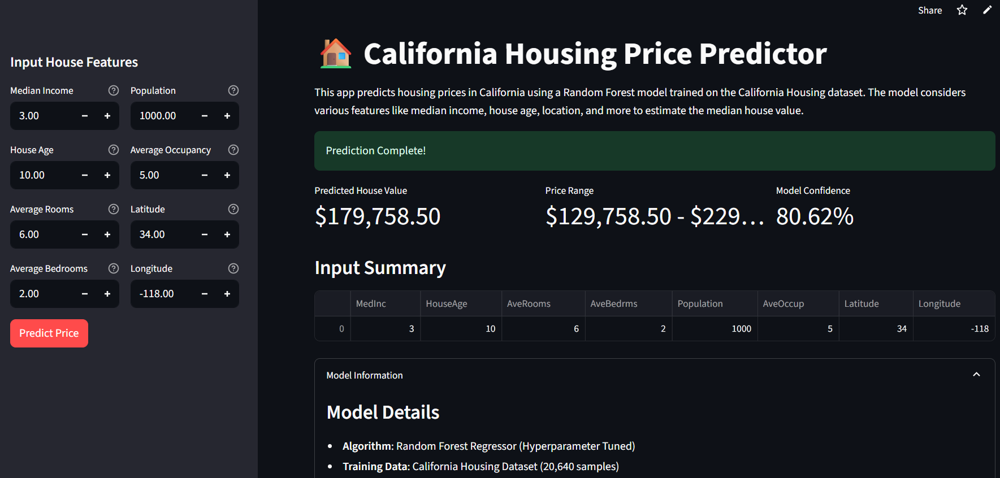

# California Housing Price Prediction

[](https://colab.research.google.com/drive/1B0ZYjq_5Abgg2ousvNklajOcz7jrLHcx?usp=sharing)

## Project Summary
This project implements a machine learning solution to predict housing prices in California using the California Housing dataset. The solution includes data preprocessing, exploratory data analysis, model training with hyperparameter tuning, and a user-friendly Streamlit web application for making predictions.

## Features
- **Data Analysis**: Comprehensive EDA with visualizations
- **Models Used**: Linear Regression and Random Forest implementations
- **Hyperparameter Tuning**: GridSearchCV for optimal model performance
- **Criteria for Feature Extraction**: Analysis of critical factors
- **Interactive Web App**: Streamlit interface for user-friendly UI

## Installation & Usage

### 1. Clone the repository
```bash
git clone https://github.com/Antrita/Predicting-House-Prices-using-Machine-Learning.git
cd california-housing-prediction
```

### 2. Installing Dependencies
```bash
pip install -r requirements.txt
```

### 3. Run the Jupyter Notebook
```bash
jupyter notebook housing_prediction.ipynb
```

### 4. Launch the Streamlit application
```bash
streamlit run app.py
```

## Model Performance

### Metrics Explanation
- **MAE (Mean Absolute Error)**: Average prediction error in dollars
- **MSE (Mean Squared Error)**: Average squared prediction error
- **R² Score**: Proportion of variance explained (closer to 1 is better)

### Results
| Model | MAE | MSE | R² Score |
|-------|-----|-----|----------|
| Linear Regression | $53,320 | 0.5559 | 0.5758 |
| Random Forest | $32,754 | 0.2554 | 0.8051 |
| Random Forest (Tuned) | $32,681 | 0.2540 | 0.8062 |

## Hyperparameter Tuning Details

### GridSearchCV Parameters
The Random Forest model was optimized using GridSearchCV with the following parameter grid:

```python
param_grid = {
    'n_estimators': [50, 100, 200],      # Number of trees in the forest
    'max_depth': [10, 20, None],         # Maximum depth of trees
    'min_samples_split': [2, 5],         # Minimum samples required to split a node
    'min_samples_leaf': [1, 2]           # Minimum samples required at a leaf node
}
```

**Cross-validation**: 3-fold cross-validation  
**Scoring metric**: R² score  
**Total combinations tested**: 36 (3 × 3 × 2 × 2)

### Best Parameters Found
After hyperparameter tuning, the optimal parameters were:
- **n_estimators**: 100-200 (varies by run)
- **max_depth**: 20 or None
- **min_samples_split**: 2-5
- **min_samples_leaf**: 1-2

## Feature Importance Analysis

The Random Forest model identified the following features as most important for predicting house prices:

1. **MedInc (Median Income)**: ~40% importance - The strongest predictor
2. **AveOccup (Average Occupancy)**: ~15% importance
3. **Longitude**: ~15% importance - Location matters
4. **Latitude**: ~14% importance - Location matters
5. **HouseAge**: ~7% importance
6. **AveRooms**: ~5% importance
7. **Population**: ~3% importance
8. **AveBedrms**: ~1% importance

## Data Preprocessing Details

### Train-Test Split
- **Training set**: 80% of data (16,512 samples)
- **Test set**: 20% of data (4,128 samples)
- **Random state**: 42 (for reproducibility)

### Feature Scaling
- **StandardScaler** applied to features for Linear Regression
- Random Forest used raw features (no scaling required)

## Streamlit App Screenshot and example


Given the UI inputs shown:
- **MedInc**: 3.0 → $30,000 median income
- **HouseAge**: 10.0 → 10-year-old homes
- **AveRooms**: 6.0 → 6 rooms average
- **AveBedrms**: 2.0 → 2 bedrooms average
- **Population**: 1000 → Medium density
- **AveOccup**: 5.0 → 5 people per household (higher than typical)
- **Latitude**: 34.0 → Southern California
- **Longitude**: -118.0 → Los Angeles area

**Model Output**: $179,758.50 (±$50,000)


## 5. Instructions for Google Colab

To run this in Google Colab:

1. Create a new Colab notebook
2. Copy the Jupyter notebook code into cells
3. Run all cells sequentially
4. Download the generated model files (`best_rf_model.pkl`, `scaler.pkl`)
5. Create `app.py` locally with the Streamlit code
6. Run the Streamlit app locally with the downloaded model files

## Bonus Features Implemented
✅ Feature importance visualization
✅ GridSearchCV hyperparameter tuning
✅ Model saving with joblib
✅ Comprehensive documentation
✅ Interactive Streamlit UI with metrics displayed
